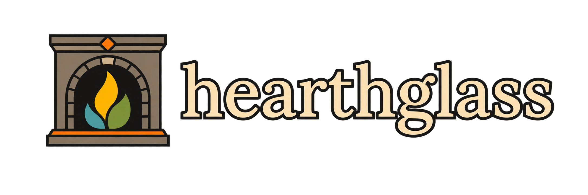

# hearthglass.nvim

<p align="center">
  
</p>

<p align="center">
  A warm, Ember-inspired Neovim colorscheme for the glow between dark and light.
</p>

A deepwhite-inspired Neovim colorscheme using the Ember palette as its base.

The dark variant (`hearthglass`) is tuned for a warm hearth feel: golden ivory
foregrounds over deep umber backgrounds, with amber/orange as the hero accent
and gold for types. Green and red are reserved as context signals — git diffs,
diagnostics, success and error states. The light variant is orange-forward: a
burnt orange hero that clears the parchment, so the gold family never washes
out against the light background. Functions run steel blue and the
preprocessor terracotta in both variants, so the accent family stays in play
instead of collapsing into one warm monochrome. See the official Ember palette
and design at [embertheme.com](https://embertheme.com/), which hearthglass
starts from.

The highlight structure is intentionally kept close to [deepwhite.nvim](https://github.com/Verf/deepwhite.nvim): syntax categories and key editor objects use deepwhite's distinctive highlighted blocks, while the palette comes from [ember-theme/nvim](https://github.com/ember-theme/nvim).

## Variants

```vim
:colorscheme hearthglass
:colorscheme hearthglass-light
:colorscheme hearthglass-auto
```

- `hearthglass` — dark Ember palette
- `hearthglass-light` — light Ember palette
- `hearthglass-auto` — follows the desktop theme when KDE or GNOME settings are available, then falls back to `background`

Toggle the active variant with:

```vim
:HearthglassToggle
```

Refresh from the current system preference after changing the desktop theme:

```vim
:HearthglassSync
```

On KDE, Hearthglass reads the `ColorScheme` value from `kdeglobals`. On
GNOME-compatible desktops, it reads `org.gnome.desktop.interface color-scheme`
through `gsettings`.

The same toggle is available from Lua:

```lua
require('hearthglass').toggle()
```

## Installation

### vim.pack

```lua
vim.pack.add {
  'https://github.com/McCune1224/hearthglass.nvim',
}

vim.cmd.colorscheme 'hearthglass'
```

### lazy.nvim

```lua
{
  'McCune1224/hearthglass.nvim',
  lazy = false,
  priority = 1000,
  config = function()
    vim.cmd.colorscheme 'hearthglass'
  end,
}
```

## Configuration

```lua
require('hearthglass').setup {
  low_blue_light = true,
}
```

`low_blue_light` only affects the light variant: it lifts the parchment
background toward white for a brighter "paper" feel.

### Colorblind-friendly modes

hearthglass uses exactly one accent pair for meaning — green for success
(diffs, `DiagnosticOk`, `Todo`) and red for error (`DiagnosticError`,
`DiffDelete`) — and that pair is the one most commonly confused. A
colorblind-safe remap replaces it:

```lua
require('hearthglass').setup {
  colorblind = 'deutan', -- or true, 'protan', 'tritan'
}
```

- `deutan` / `protan` (red-green deficiency, the common case): red shifts
  toward rose and green toward teal. Both keep enough blue component to stay
  apart for deuteranopia and protanopia, and cyan moves to a darker steel so
  it does not collide with the new teal. The olive and brick syntax slabs are
  re-tinted to match.
- `tritan` (blue-yellow deficiency): blue shifts toward violet and cyan
  toward steel so they stop colliding with the gold/yellow family.
- `true` is an alias for `'deutan'`.

The remap applies to both the dark and light variants, survives
`:HearthglassToggle` / `:HearthglassSync`, and the lualine themes follow it.
Cursor and search keep their single amber accent in every mode.

For lualine, use the matching theme explicitly:

```lua
require('lualine').setup {
  options = {
    theme = 'hearthglass',
  },
}
```

The repository also includes `hearthglass-light` under `lua/lualine/themes/`.

## Terminal (kitty)

The same Ember palette is available as a kitty terminal theme, with matching
day and night modes. The shipped confs are `kitty/hearthglass.conf` (night) and
`kitty/hearthglass-light.conf` (day). They're generated from the palette by
`kitty/hearthglass.py`, which honors the same `low_blue_light` and
`colorblind` options as the colorscheme.

Note: `kitty/hearthglass.py` is a plain script — run it with `python3`, not as a
`kitten` subcommand. This kitty only ships its builtin kittens. The script
delegates all theme changes to the `kitten` CLI tool.

### Switch with `kitten themes` (recommended)

Install the confs so the `kitten themes` CLI can find them:

```sh
python3 kitty/hearthglass.py install    # copies both confs into ~/.config/kitty/themes
```

Then switch through the kitten CLI:

```sh
kitten themes                    # interactive picker (choose hearthglass / -light)
kitten themes hearthglass        # switch to dark
kitten themes hearthglass-light  # switch to light
```

### Apply live (day / night / toggle)

For a non-persistent switch on the running kitty, use `kitten @ set-colors`.
The script wraps it (it needs kitty remote control enabled in `kitty.conf`):

```sh
allow_remote_control yes
listen_on unix:/tmp/kitty
```

```sh
python3 kitty/hearthglass.py night      # dark terminal theme
python3 kitty/hearthglass.py day        # light terminal theme
python3 kitty/hearthglass.py toggle     # switch based on the current background
```

Or call the kitten CLI directly:

```sh
kitten @ set-colors kitty/hearthglass.conf
```

Each script command honors the same options as the colorscheme:

```sh
python3 kitty/hearthglass.py day --low-blue-light
python3 kitty/hearthglass.py night --colorblind deutan
```

Regenerate the conf files from the palette (after changing options) with:

```sh
python3 kitty/hearthglass.py build kitty
```

## Attribution

The highlight-group organization and visual structure are derived from
[Verf/deepwhite.nvim](https://github.com/Verf/deepwhite.nvim), released under
the MIT License. The palette direction is based on the official Ember theme
website at [embertheme.com](https://embertheme.com/) and its Neovim
implementation at [ember-theme/nvim](https://github.com/ember-theme/nvim).
